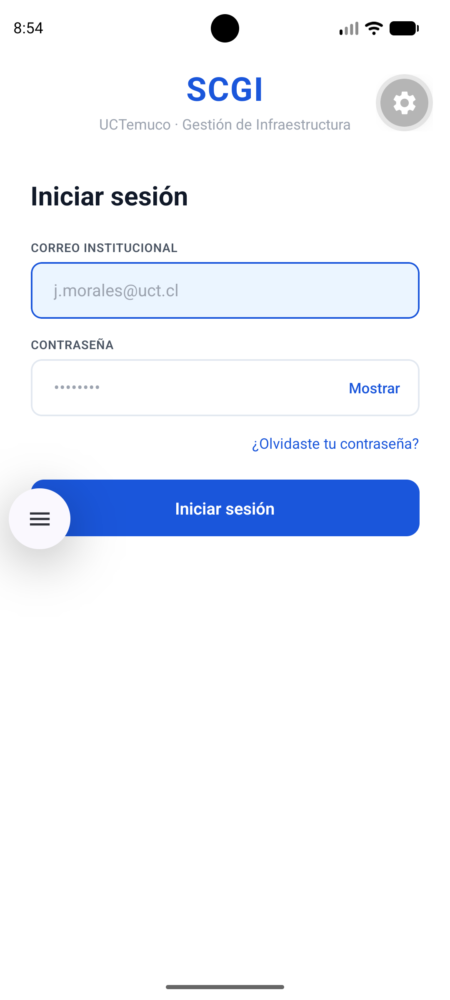
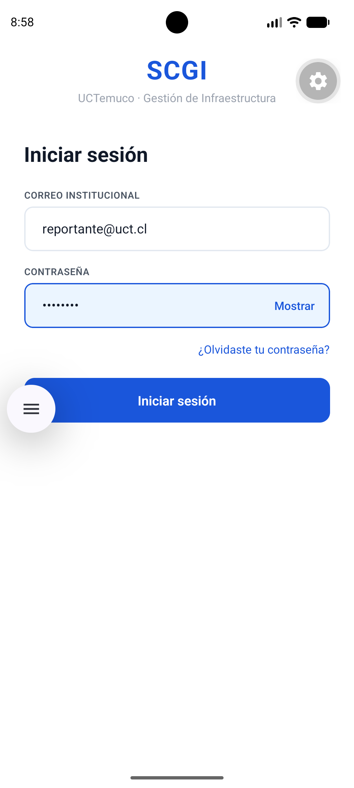
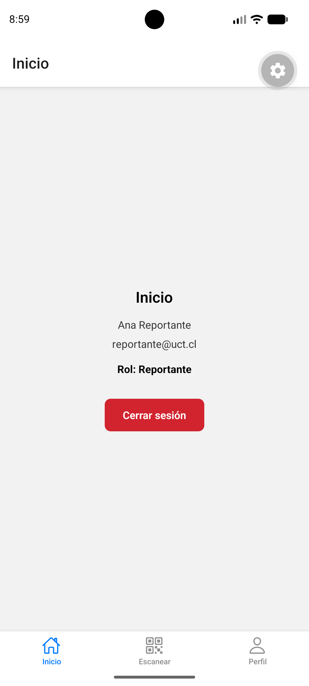

# Evidencia RNF5 — Usabilidad táctil con una sola mano

**Responsable:** Débora Vizama
**Fecha:** 21-09-2026
**Dispositivo de prueba:** Emulador Android (Pixel 7, API 37.1)

## Qué se probó
Se verificó que los elementos interactivos principales de LoginScreen y
ProfileScreen estén ubicados en el tercio inferior de la pantalla,
alcanzables con el pulgar sin necesidad de usar la segunda mano, y que
todos los touch targets cumplan el mínimo de 44px.

## Checklist

| Elemento | Ubicación | Alcanzable con una mano | Touch target |
|---|---|---|---|
| Botón "Iniciar sesión" | Tercio inferior | Sí | 52px |
| Campos de correo/contraseña | Centro-inferior | Sí | 52px |
| Botón "Mostrar/Ocultar" contraseña | Dentro del campo, lado derecho | Sí | — |
| Enlace "¿Olvidaste tu contraseña?" | Sobre el botón principal | Sí | — |
| Botón "Cerrar sesión" | Centro-inferior | Sí | 52px |
| Tabs de navegación (Inicio/Escanear/Perfil) | Borde inferior fijo | Sí | — |

## Flujo probado
1. Apertura de la app → LoginScreen vacío.
2. Ingreso de correo y contraseña de prueba (reportante@uct.cl).
3. Envío del formulario → validación exitosa → redirección automática
   a la app logueada.
4. Navegación al tab "Perfil" → visualización de datos del usuario y
   botón de cerrar sesión.

## Evidencia fotográfica

## Conclusión
El flujo de login y perfil cumple con RNF5: los elementos principales
están dentro de la zona de alcance del pulgar, con touch targets
iguales o superiores a 44px, y la navegación entre pantallas no
requiere el uso de la segunda mano.