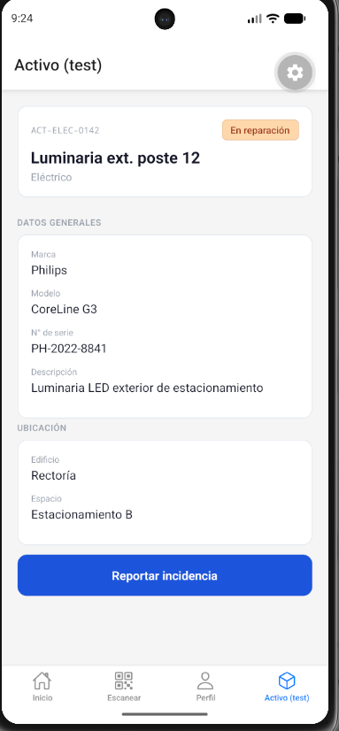

# Evidencia RNF6 — Compatibilidad multiplataforma (Android)

**Responsable:** Débora Vizama
**Fecha:** 23-09-2026
**Dispositivo de prueba:** Emulador Android (Pixel 7, API 37.1)

## Alcance de la verificación
Por decisión del equipo (Scrum Master), la verificación de compatibilidad
multiplataforma en este sprint se realiza únicamente en Android. La
verificación en iOS queda fuera de alcance, ya que los simuladores de
iOS (Xcode) requieren macOS, entorno no disponible actualmente en el
equipo.

## Qué se probó
Se verificó el funcionamiento visual de AssetDetailScreen (ficha de
detalle del activo) en el emulador Android.

## Checklist

| Aspecto | Resultado |
|---|---|
| Textos no se cortan ni desbordan | OK |
| Tarjetas (Card) con espaciado correcto | OK |
| StatusBadge muestra color/texto correcto | OK |
| Scroll funciona correctamente | OK |
| Botón "Reportar incidencia" alcanzable | OK |
| Bottom tab bar no tapa contenido | OK |

## Evidencia fotográfica

## Conclusión
AssetDetailScreen funciona correctamente en Android. Queda pendiente
la verificación en iOS para un sprint futuro, sujeto a disponibilidad
de un dispositivo o entorno macOS.